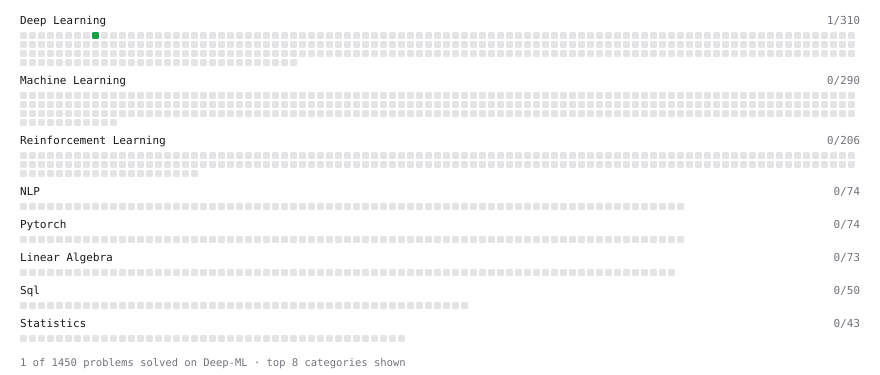

# Deep-ML

My machine learning practice from [Deep-ML](https://www.deep-ml.com). Every solution here was written by hand.

**4** solved · 1 problems · 0 labs · 3 math

[**Browse the interactive portfolio**](https://krijnD.github.io/deep-ml/) to replay this filling in over time.

## Problems

| | Difficulty | Solved | |
| --- | --- | --- | --- |
| [Implement ReLU Activation Function](https://www.deep-ml.com/problems/42) | easy | 2026-09-25 | [solution](problems/0042-implement-relu-activation-function) |

## Math

| | Difficulty | Solved | |
| --- | --- | --- | --- |
| [Matrix Basics](https://www.deep-ml.com/math-problems/9) | easy | 2026-09-25 | [solution](math/0009-matrix-basics) |
| [Vector Operations](https://www.deep-ml.com/math-problems/7) | easy | 2026-09-25 | [solution](math/0007-vector-operations) |
| [Matrix Multiplication](https://www.deep-ml.com/math-problems/10) | medium | 2026-09-25 | [solution](math/0010-matrix-multiplication) |

---

_This file is regenerated by Deep-ML on every push._
